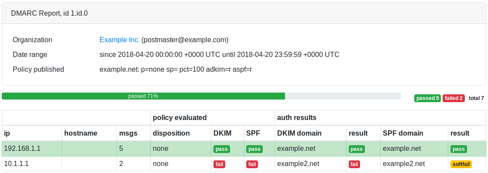

dmarc-report-converter
======================

Convert DMARC report files from xml to human-readable formats. Files can be located on a local
filesystem or on an IMAP server.

Example of html_static output:


Support input formats:

* **.xml** file: dmarc report in xml format

* **.gz** file: gzipped dmarc report in xml format

* **.zip** file: zipped dmarc report in xml format

Support output formats:

* **html_static** output file is the html, generated from template templates/html_static.gotmpl.
  This format uses bootstrap hosted on bootstrapcdn, so you don't need to configure self-hosted
  bootsrap assets.

* **html** output file is the html, generated from template templates/html.gotmpl.
  This format uses self-hosted bootsrap and javascript assets, so you need to configure your web
  server and *output -> assets_path* option.

* **txt** output file is the plain text, generated from template templates/txt.gotmpl

* **json** output file is the json

Installation
------------

1. Get installation archive. There are two ways: download pre-builded archive from
   [github releases](https://github.com/tierpod/dmarc-report-converter/releases) page or
   [build from sources](#building-from-sources)

2. Unpack to destination directory, for example to "/opt":

   ```bash
   sudo tar -xvf dmarc-report-converter*.tar.gz -C /opt
   ```

3. Copy example config file and [edit](#configuration):

   ```bash
   cd /opt/dmarc-report-converter/
   sudo cp config.dist.yaml config.yaml
   sudo nano config.yaml
   ```

4. If you want to execute it daily, add crontab daily job:

   ```bash
   sudo cp install/dmarc-report-converter.sh /etc/cron.daily/
   ```

   or systemd service unit + systemd timer unit (see examples in "install" directory)

5. If you want to use "html" output, you have to configure your web server to serve **assets**
   directory and change assets_path in configuration file. Example for nginx:

   ```bash
   sudo cp -r assets /usr/share/nginx/html
   ```

   config.yaml:

   ```yaml
   output:
     assets_path: "/dmarc/assets"
   ```

   location configuration:

   ```nginx
   location /dmarc/ {
       root /usr/share/nginx/html;
       autoindex           on;
       autoindex_localtime on;
   }
   ```

    and go to the http://your-web-server/dmarc

Configuration
-------------

Copy config/config.dist.yaml to config.yaml and change parameters:

* **lookup_addr** (bool): perform reverse lookup? If enabled, may take some time.

* **merge_reports** (bool): merge multiple similar reports to one?

* **log_debug** (bool): print debug log messages?

* **log_datetime** (bool): print log messages datetime?

**input** section:

* **dir** (str): directory with input files

* **delete** (bool): delete source files after conversion?

* **imap** *(optional section)*: dmarc-report-converter can fetch reports from IMAP server and save
  them to **input -> dir** before conversion started. To achieve this, configure this subsection.

  * **server**, **username**, **password**, **mailbox** (str): IMAP server address, credentials and
    mailbox name

  * **delete** (bool): delete email messages from IMAP server after successful fetching?

  * **debug** (bool): print debug messages during IMAP session?

**output** sections:

* **file** (str): output file, should be string or golang template. If value is empty string "" or
  "stdout", print result to stdout.

* **format** (str): output format (txt, json, html_static, html)

* **assets_path** (str): path to assets for html output format.

Weekly or monthly reports
-------------------------

Many providers send reports to your email address every day. If you want to get weekly or monthly
reports:

* Set **input -> delete: yes** and **input -> imap -> delete: yes**, because all old reports should
  be deleted from the source

* Set **merge_reports: yes**, because all similar reports should be merged

* Execute dmarc-report-converter every **week** / **month** (add weekly / monthly crontab task or
  systemd timer)

* Replace **output -> file -> {{ .ID }}** shortcut with **{{ .TodayID }}**, if you want to create
  output file with current date in filename (instead of begin report date).

Building from sources
---------------------

1. Install go compiler and building tools:

   ```bash
   # debian/ubuntu
   sudo apt-get install golang-go make git tar

   # centos/fedora, enable epel-release repo first
   sudo yum install epel-release
   sudo yum install golang make git tar
   ```

   or follow [official instruction](https://golang.org/dl/)

2. Download sources:

   ```bash
   go get -u github.com/tierpod/dmarc-report-converter
   ```

3. Build binary and create installation archive:

   ```bash
   cd $HOME/go/src/github.com/tierpod/dmarc-report-converter
   make release
   ```

4. Installation archive will be places inside _release_ directory. Also, if you want to test
   dmarc-report-converter without installation, you can execute:

   ```bash
   ./bin/dmarc-report-converter -config /path/to/config.yaml
   ```

Thanks
------

* [bootstrap](https://getbootstrap.com/)
* [jquery](http://jquery.com/)
* [ChartJS](http://chartjs.org/)
* [golang emersion packages](https://github.com/emersion) (go-imap, go-message, go-sasl, go-textwrapper)
